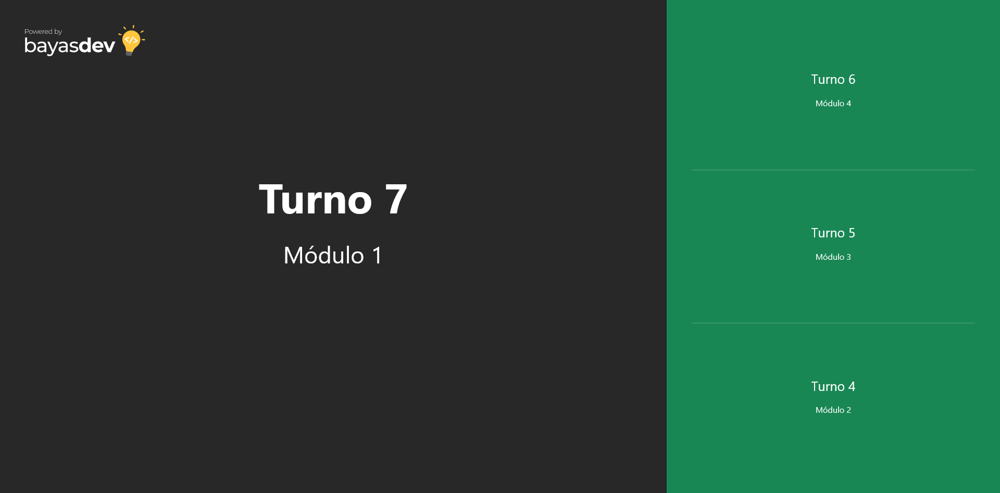
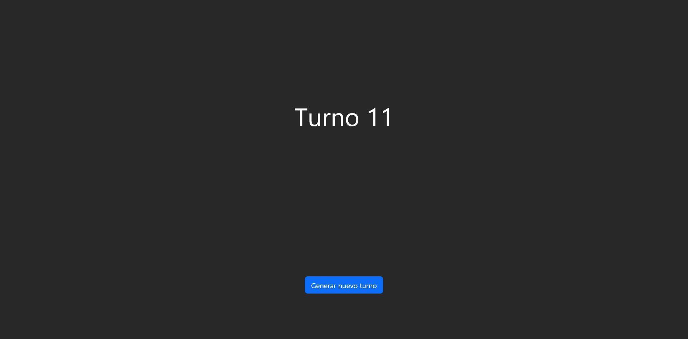
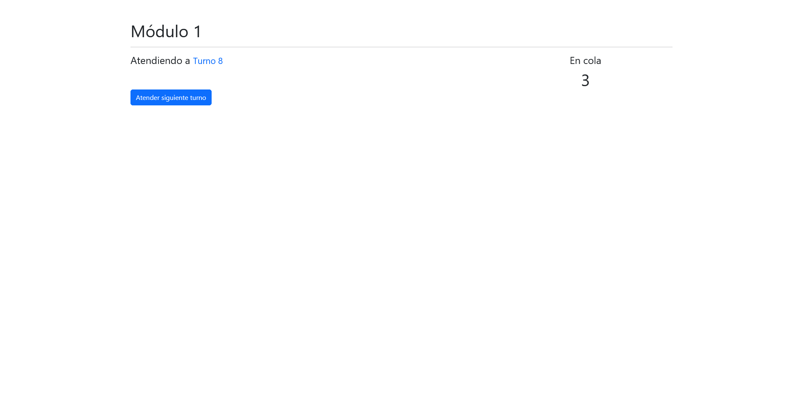

# node-socketio-turnos

Sistema de turnero web implementado con WebSockets.

## Stack
- Node
- Express
- SocketIO

## Características
- Creación de turnos
- Atención de turnos por módulo
- Pantalla para mostrar los turnos atendidos

## Setup
1. `npm install`
2. `node app.js`
3. El servicio se ejecuta en el puerto 8080

## Screenshots

Pantalla pública

Crear turno

Módulo

# Copyright
2022 Victor Bayas
